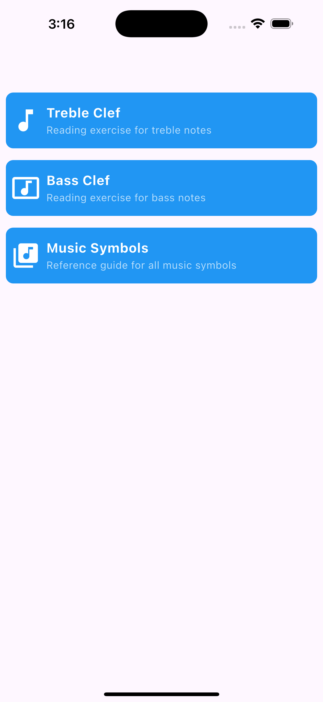
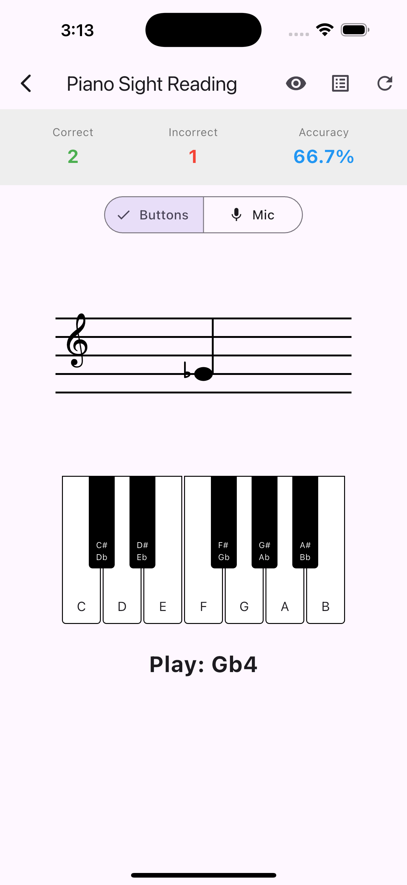
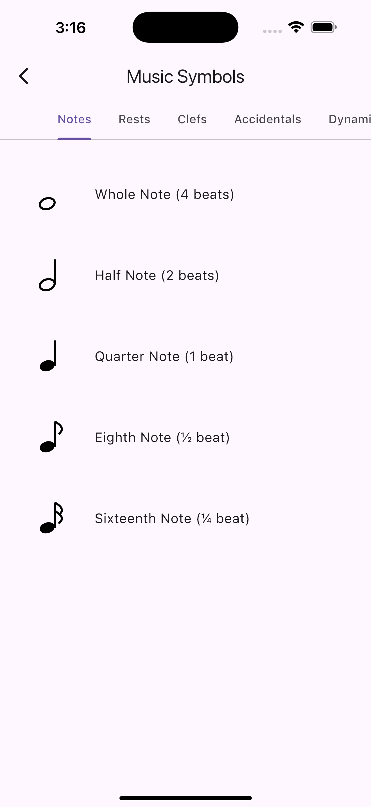

# Piano Sight Reading Trainer

<p>
  
  
  
  
</p>


Flutter mobile app for acoustic piano sight-reading training using MVVM architecture with Stacked.

## Architecture

### MVVM + Stacked Pattern

```
┌─────────────────────────────────────────────────────────┐
│                         View                            │
│              (StatelessWidget + Stacked)                │
│  - Displays staff, note, feedback                       │
│  - Observes ViewModel via ViewModelBuilder.reactive     │
└────────────────────┬────────────────────────────────────┘
                     │ notifyListeners()
                     ▼
┌─────────────────────────────────────────────────────────┐
│                     ViewModel                           │
│              (extends BaseViewModel)                    │
│  - Current note state                                   │
│  - Score tracking (SessionStats)                        │
│  - Validation logic                                     │
│  - Reaction time tracking                               │
└────────────┬────────────────────────┬────────────────────┘
             │                        │
             ▼                        ▼
┌────────────────────────┐  ┌────────────────────────────┐
│   NoteGeneratorService │  │      AudioService          │
│  - Random note gen     │  │  - Microphone streaming    │
│  - MIDI → staff pos    │  │  - Pitch detection         │
└────────────────────────┘  │  - Frequency → MIDI        │
                            │  - Stability filtering     │
                            └────────────────────────────┘
                                       │
                                       ▼
                            ┌────────────────────────────┐
                            │   Platform Channels        │
                            │  Android: TarsosDSP        │
                            │  iOS: AudioKit             │
                            └────────────────────────────┘
```

## Project Structure

```
lib/
├── main.dart                           # Entry point
├── app/
│   └── app.dart                        # App configuration
├── models/
│   ├── musical_note.dart               # Note data (MIDI, name, position)
│   └── session_stats.dart              # Statistics tracking
├── services/
│   ├── audio_service.dart              # Pitch detection + stability
│   └── note_generator_service.dart     # Random note generation
├── ui/
│   ├── views/
│   │   └── training/
│   │       ├── training_view.dart      # Main UI (StatelessWidget)
│   │       └── training_viewmodel.dart # Business logic
│   └── widgets/
│       ├── staff_painter.dart          # CustomPainter for staff
│       └── feedback_overlay.dart       # Green/red animations
└── utils/
    └── pitch_converter.dart            # Frequency ↔ MIDI conversion
```

## Key Features

### Pitch Detection Flow

1. **Microphone Input** → AudioService receives frequency + amplitude via platform channel
2. **Filtering** → Ignore low amplitude (<0.1), collect samples in 800ms window
3. **Stability Check** → Require same note for 200ms minimum
4. **MIDI Conversion** → `midi = 69 + 12 * log2(frequency / 440)`
5. **Validation** → Compare detected MIDI with expected note
6. **Feedback** → Green (correct) or Red (incorrect) animation
7. **Next Note** → Auto-advance after 500ms

### Statistics Tracking

- **Correct/Incorrect counts**
- **Accuracy percentage**
- **Most missed note** (MIDI number)
- **Average reaction time** (ms)

## Setup Instructions

### 1. Install Dependencies

```bash
flutter pub get
```

### 2. Platform-Specific Setup

#### Android (TarsosDSP)
See [ANDROID_SETUP.md](ANDROID_SETUP.md) for:
- Adding TarsosDSP dependency
- Microphone permissions
- Native Kotlin integration

#### iOS (AudioKit)
See [IOS_SETUP.md](IOS_SETUP.md) for:
- Adding AudioKit via CocoaPods
- Microphone permissions
- Native Swift integration

### 3. Run the App

```bash
flutter run
```

## Development Phases

### ✅ Phase 1: Core Architecture
- MVVM structure with Stacked
- Models (MusicalNote, SessionStats)
- Services (AudioService, NoteGeneratorService)

### ✅ Phase 2: UI Rendering
- CustomPainter for staff + treble clef
- Note rendering with ledger lines
- Stats display

### ⏳ Phase 3: Native Integration
- Implement Android TarsosDSP integration
- Implement iOS AudioKit integration
- Test microphone permissions

### ⏳ Phase 4: Pitch Detection
- Verify frequency detection
- Test MIDI conversion accuracy
- Tune stability parameters

### ⏳ Phase 5: Validation & Feedback
- Test note matching logic
- Refine feedback animations
- Optimize latency

### ⏳ Phase 6: Statistics & Polish
- End-of-session summary screen
- Reaction time optimization
- UI/UX improvements

## Production Improvements

### Audio Processing
- **Harmonic filtering**: Detect fundamental frequency vs overtones
- **Noise gate**: Adaptive amplitude threshold
- **Calibration**: Allow A4 = 440Hz adjustment
- **Sustain pedal handling**: Detect note release vs sustain

### User Experience
- **Difficulty levels**: Beginner (tolerance ±1 semitone), Advanced (exact match)
- **Note range selection**: Customize treble clef range
- **Practice modes**: Specific notes, scales, intervals
- **Progress tracking**: Historical statistics, daily streaks

### Performance
- **Background processing**: Offload pitch detection to isolate
- **Buffer optimization**: Reduce latency to <100ms
- **Memory management**: Clear old samples efficiently

### Testing
- **Unit tests**: PitchConverter, SessionStats logic
- **Widget tests**: Staff rendering, feedback animations
- **Integration tests**: End-to-end note validation flow

## Key Classes

### AudioService
- Manages microphone streaming via platform channels
- Implements pitch stability filtering (800ms window, 200ms stability)
- Streams detected MIDI notes to ViewModel

### TrainingViewModel
- Extends BaseViewModel (Stacked)
- Manages current note, score, feedback state
- Validates detected notes against expected
- Calls notifyListeners() to update UI

### StaffPainter
- CustomPainter for musical staff rendering
- Draws 5 staff lines, treble clef, note head + stem
- Handles ledger lines for notes outside staff

### PitchConverter
- Frequency → MIDI: `69 + 12 * log2(f / 440)`
- MIDI → Note name: "C4", "D#5", etc.
- Note matching with optional tolerance

## License

MIT
